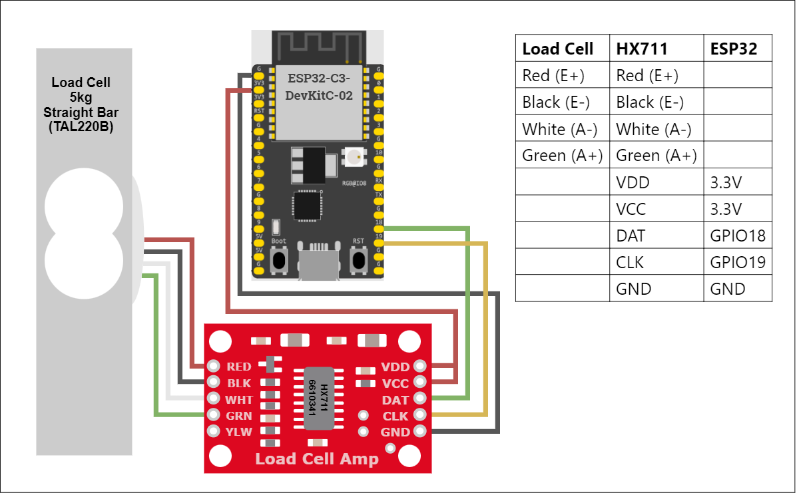

## Introduction

This project aims to create a system capable of measuring weights using a load cell sensor. The ESP32 microcontroller reads data from the load cell via the amplifier and sends the data to a computer for further processing and visualization.


---
- [Introduction](#introduction)
- [Hardware Components](#hardware-components)
- [Wiring Guide](#wiring-guide)
- [Installation](#installation)
- [Usage](#usage)


## Hardware Components

- **ESP32 Microcontroller**
- **HX711 Load Cell Amplifier**
- **Load Cell**
- **Breadboard and Connecting Wires**
- **Computer with Python Installed**

## Wiring Guide

<!-- | **Load Cell** | **HX711**     | **ESP32** |
|---------------|-----------    |-----------|
| Red (E+)      | Red (E+)      |           |
| Black (E-)    | Black (E-)    |           |
| White (A-)    | White (A-)    |           |
| Green (A+)    | Green (A+)    |           |
|               | VDD           | 3.3V      |
|               | VCC           | 3.3V      |
|               | DAT           | GPIO18    |
|               | CLK           | GPIO19    |
|               | GND           | GND       | -->


<div style="display: flex; justify-content: space-around; align-items: center;">
   <table>
      <tr>
         <th>Load Cell</th>
         <th>HX711</th>
         <th>ESP32</th>
      </tr>
      <tr>
         <td>Red (E+)</td>
         <td>Red (E+)</td>
         <td></td>
      </tr>
      <tr>
         <td>Black (E-)</td>
         <td>Black (E-)</td>
         <td></td>
      </tr>
      <tr>
         <td>White (A-)</td>
         <td>White (A-)</td>
         <td></td>
      </tr>
      <tr>
         <td>Green (A+)</td>
         <td>Green (A+)</td>
         <td></td>
      </tr>
      <tr>
         <td></td>
         <td>VDD</td>
         <td>3.3V</td>
      </tr>
      <tr>
         <td></td>
         <td>VCC</td>
         <td>3.3V</td>
      </tr>
      <tr>
         <td></td>
         <td>DAT</td>
         <td>GPIO18</td>
      </tr>
      <tr>
         <td></td>
         <td>CLK</td>
         <td>GPIO19</td>
      </tr>
      <tr>
         <td></td>
         <td>GND</td>
         <td>GND</td>
      </tr>
   </table>
   
</div>

## Installation

1. Clone the repository:

   ```sh
   git clone https://github.com/yourusername/LoadCellMeasurementSystem.git
   ```

2. Navigate to the project directory:

   ```sh
   cd LoadCellMeasurementSystem
   ```
3. Create a virtual environment and activate it (optional). This program was tested on Python 3.8.
4. Install the required Python packages:

   ```sh
   pip install -r requirements.txt
   ```

## Usage

1. **Setting Up the ESP32:**
   - Upload the `main.cpp` code to your ESP32 using the Arduino IDE or PlatformIO.

2. **Running the Python Scripts:**
   - **`src/graph.py`:** This script reads weight data from the ESP32 via a serial connection, processes the data, and generates real-time graphs to visualize the weight measurements.

        Make sure the esp32 is connected to the computer and run the following command:
     ```sh
     python src/graph.py
     ```
     The script will automatically search for the port where the ESP32 is connected and establish a serial connection. If the connection is successful, the weight data will be displayed in real-time.

   - **`src/graphBluetooth.py`:** This script reads weight data from the ESP32 via a Bluetooth connection, processes the data, and generates real-time graphs to visualize the weight measurements. (Note: The ESP32 does not need to be connected to the PC for this script). 
  
        Make sure your computer has Bluetooth capabilities. Run the following command:
     ```sh
     python src/graphBluetooth.py
     ```
        The script will automatically search for the ESP32 via Bluetooth and establish a connection. If the connection is successful, the weight data will be displayed in real-time.

